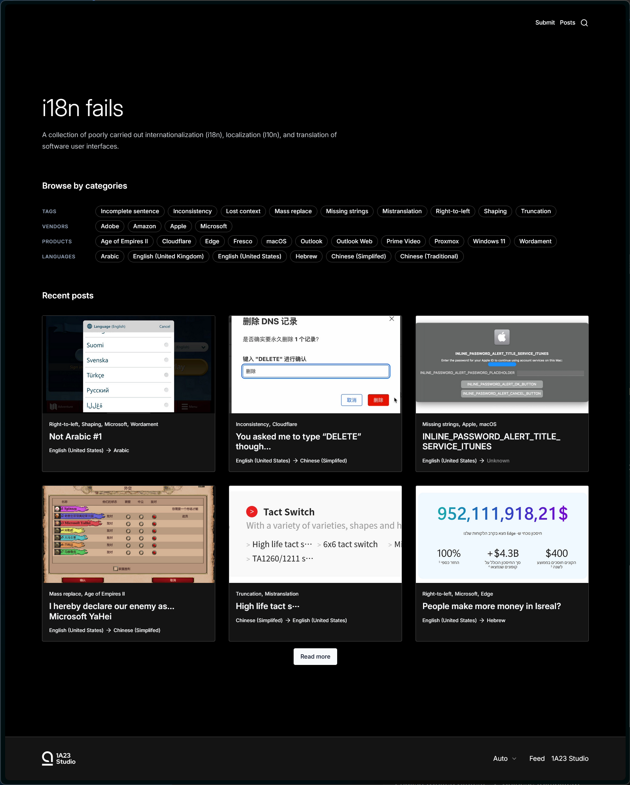

# i18n fails

A collection of poorly carried out internationalization (i18n), localization (l10n), and translation of software user interfaces.

[Visit site](https://i18nfails.1a23.studio/).

i18n fails is built based on [Payload Website Template](https://github.com/payloadcms/payload/blob/main/templates/website).